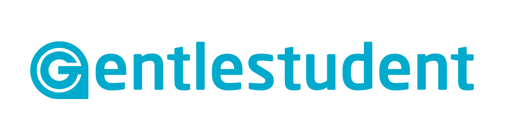

Open Badges Project for Arteveldehogeschool

## About
Gentlestudent is an application that allows the user to ask students for help. With the application, anyone can issue a learning opportunity and students using the application can decide to help the issuer. After helping the issuer, the student gets a badge as a reward, which is a verifiable record of their learning. This way, Gentlestudent stimulates informal learning and teaches valuable lessons about community life and social engagement.

The application uses open badges to reward students for completing learning opportunities. T he application uses beacon technology to localize the learning opportunities. If you’re close to the learning opportunity, you’ll be able to see where you need to be.

## Where to find
You can download the application on [Android](https://play.google.com/store/apps/details?id=gent.gentlestudent.gentlestudent) (Apple is on it's way!). You can also use the [web application](http://gentlestudent.gent/).

## Team
| Member        | Function          |
| ------------- |:-------------:| 
| Bert Jehoul     |Coach |
| Bram De Coninck    | Full stack developer     |
| Stijn Mets |Back-end developer     | 
|Maxime Van Driessche  |Front-end developer     | 
| Marie-Sophie Verwee  |Back-end developer     | 
| Michael Viaene  |Back-end developer     | 
